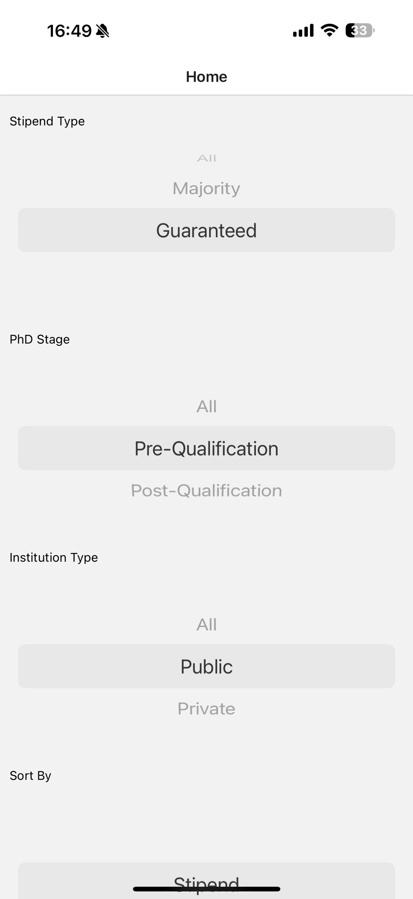
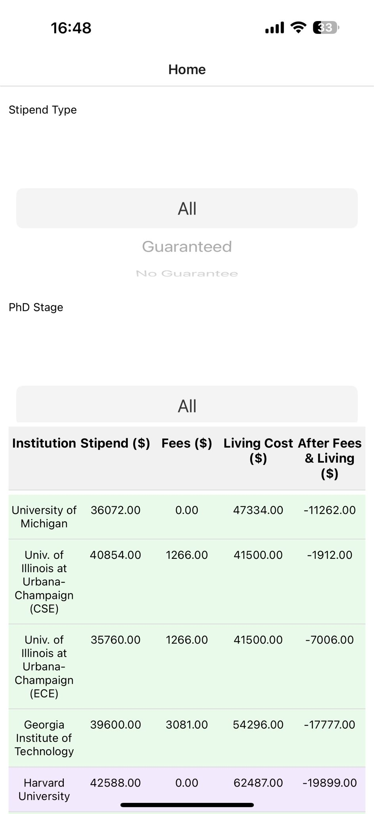
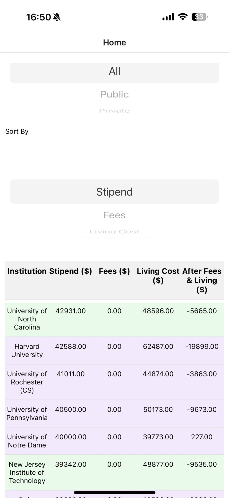
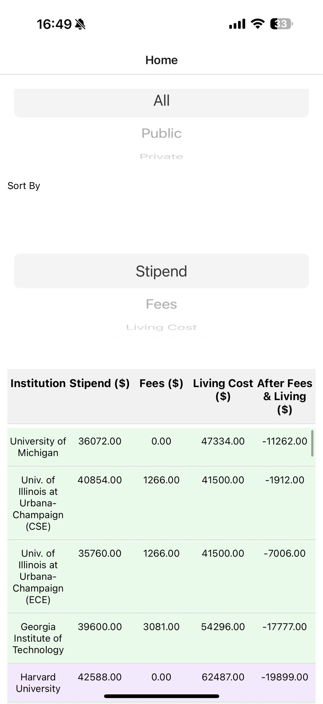

# CS Stipend Rankings Mobile App

This repository contains the **CS Stipend Rankings** mobile application, which replicates and extends the features of the website [csstipendrankings.org](https://csstipendrankings.org/). The app allows users to easily compare PhD stipends across different universities in the United States, providing data on stipends, fees, and living costs with comprehensive filtering options.

## Features

The app includes the following features:

### 1. CSV Data Parsing
- The stipend data is fetched from a CSV file hosted online, parsed using the **Papa Parse** library.

### 2. Filters
The app provides the following filtering options to customize data views:
- **Stipend Type**: Filter by the type of funding guarantee (e.g., *Guaranteed*, *No Guarantee*).
- **PhD Stage**: Filter by the stage of the PhD program (e.g., *Pre-Qualification*, *Post-Qualification*).
- **Institution Type**: Filter by the type of institution (e.g., *Public*, *Private*).
- **Sort By**: Sort the data by different categories including:
  - **Stipend ($)**
  - **Fees ($)**
  - **Living Cost ($)**
  - **After Fees & Living ($)**

### 3. Dynamic Calculations
- **Fees ($)** and **Living Cost ($)** are parsed directly from the CSV data.
- **After Fees & Living ($)** is calculated as:
This calculation dynamically updates based on filters.

### 4. Interactive UI
- Displays the stipend data in a tabular format using **FlatList**.
- Rows are color-coded based on the institution type:
- **Green** for Public Institutions.
- **Violet** for Private Institutions.

## Screenshots

Here are a few screenshots of the application in action:

### **Home Screen with All Filters**


### **Sorted by Stipend**


### **Institution Filter - Public**


### **Filtered with Stipend Type**


## How to Use the App
## Development Setup

1. Clone the repository:
   ```bash
   git clone <repository-url>
   cd cs-stipend-rankings
2. Install dependencies:
   ```bash
   npm install
3. Run the app
   ```bash
   npx expo start 


## Test Cases

The app is tested using **Jest** to ensure functionality:

- **Calculation Accuracy**:  
  Tests verify that all stipend calculations, including *After Fees & Living*, are correct.

- **Filters**:  
  Tests check that filters for:
  - Stipend Type
  - PhD Stage
  - Institution Type  
  function as intended.

- **Sorting**:  
  Tests confirm that sorting options (e.g., by stipend, fees, living cost, or after fees & living) are accurate.
